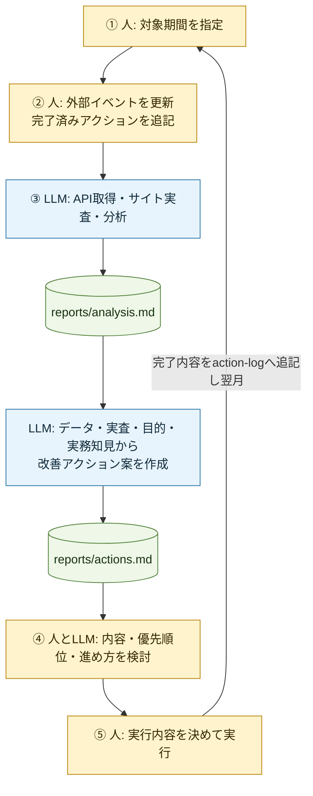
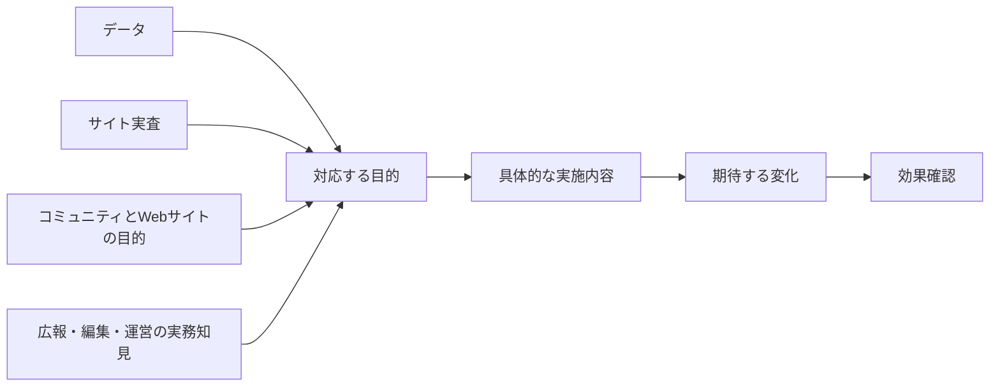

# AIエージェント分析フロー設計

この文書は内部機能と判断境界を説明する。利用者向けの実行方法は
[`README.md`](../README.md)、目的と要件は [`plan.md`](../plan.md) を参照する。

## 1. 全体フロー



LLMが自動化する範囲は、収集、検算、分析、原因仮説、改善アクション案の作成までである。
実行の最終判断、実装、公開、現実世界での活動は人が行う。

## 2. 分析と提案を分ける理由

分析中に改善案も同時に考えると、提案したい施策へ都合のよい事実や仮説を選ぶ危険がある。
このため内部処理を次の2段階に分ける。

| 段階 | 入力 | 出力 | 禁止 |
| --- | --- | --- | --- |
| データ収集・分析 | 期間、入力MD、GA4、GSC、公開サイト | `reports/analysis.md` | アクション提案 |
| アクション提案 | 人が確認した `analysis.md`、目的、実査、入力情報 | `reports/actions.md` | 分析結果の書き換え、実装、公開 |

一括実行でも内部ではこの順序を守る。2段階実行では、2つの処理の間で人が
`analysis.md` を確認・修正できる。

## 3. 目的とアクションの関係

`plan.md` のLP・ブログ×3対象者は、分析の確認漏れを防ぐための観点である。
アクション案はこの目的を前進させるために作り、対象者ごとの件数は固定しない。



データは状況理解と優先順位付けの重要な参考情報だが、唯一の提案条件ではない。
統計的有意差、大きなサンプル数、分析データとの直接対応を必須にしない。データが
少ない領域でも、目的、公開サイトの観察、実務知見から有用と考えられる施策を提案できる。

各案は、主な起点を「データ」「サイト実査」「目的」「実務仮説」から明示し、
対応する目的、提案理由、実施内容、期待する変化、定量・定性の確認方法を説明する。
これは統計的な提案条件ではなく、人が実行可否を検討するための情報である。

## 4. 改善アクションの範囲

### Webサイト内

- LP・ブログの内容、導線、CTA、内部リンク、情報構造
- 記事の作成・更新・整理
- 新しいコンテンツ企画
- 投稿画面、CMS、編集支援
- 参加者が投稿・編集・運営へ関わりやすくするWeb上の仕組み
- SEO、検索・外部流入に対応するコンテンツ
- 計測、レビュー、公開、保守、振り返り

### Webサイト外・現実世界

- SNS、メール、外部メディア、地域団体との連携
- 参加者へのインタビュー、投稿支援、編集支援
- 勉強会、イベント、記事づくりなどのコミュニティ施策
- サイト開発・運営を学習機会にする改善プロジェクト

Webサイト上の変更を伴わないことだけを理由に、現実世界の施策を除外しない。
コミュニティまたはWebサイト運営の目的にどう寄与するか、実施条件、想定負担を
説明する。一般論を並べるのではなく、HAGAKUREの状況で実行できる内容へ具体化する。

すぐに行う対応、継続施策、設計・準備が必要な中長期施策を目的と状況に応じて
提案する。施策の規模や期間を一律に制限しない。

## 5. 人とエージェントの役割

| 作業 | 担当 | 判断境界 |
| --- | --- | --- |
| 対象期間 | 人 | 自然文で指定 |
| 外部イベント | 人 | 今回分へ置換 |
| 実施済みアクション | 人 | 完了内容だけ累積 |
| API取得・比較期間計算 | エージェント・プログラム | 実行時に再取得 |
| データ品質検査 | プログラム | 異常時は推測で補わない |
| 事実・仮説の整理 | エージェント、人が確認 | 因果を断定しない |
| 改善アクション案 | エージェント、人が検討 | 起点と目的、理由を説明 |
| 内容・優先順位・進め方 | 人とエージェント | 最終判断は人 |
| 実装・公開 | 人 | 分析実行では変更しない |
| 実施記録 | 人 | 完了後だけ追記 |

## 6. ファイル構成

```text
inputs/
  external-events.md
  action-log.md

reports/
  analysis.md
  actions.md

.analysis/current/
  raw/
  context.md
  manifest.json
  quality-report.md
  content-notes.md
  stage-status.md
```

人が見るのは `reports/` の2ファイルである。履歴、月別フォルダ、実行IDは作らない。

## 7. 実行方式

### 一括実行

[`RUN_ANALYSIS.md`](../prompts/RUN_ANALYSIS.md) が分析段階と提案段階を続けて実行する。
利用者の依頼は1回である。

### 2段階実行

[`RUN_ANALYSIS_STEP_BY_STEP.md`](../prompts/RUN_ANALYSIS_STEP_BY_STEP.md) を2回使用する。

1. 対象期間付きの開始依頼で `01_ANALYZE.md` を実行
2. 共通の次へ進む依頼で `02_PROPOSE_ACTIONS.md` を実行

現在位置は `.analysis/current/stage-status.md` に
`analysis_complete` または `actions_complete` として自動保存する。利用者は番号やIDを
管理しない。

独立検証を利用者向けの追加段階にはしない。数値検算は分析段階、目的との整合性や
具体性の確認は提案段階の完了条件として実行する。

## 8. 再実行と最新版

- 新しい分析を開始すると `.analysis/current/` と2つのレポートを置き換える。
- アクション提案だけを再実行すると `analysis.md` を残し、`actions.md` だけを置き換える。
- 人が `analysis.md` または `actions.md` を修正した場合は修正後を最新版とする。
- 過去版は自動保存しない。

## 9. 品質を安定させる仕組み

### データ

- APIページング
- 期間・行数・合計値の検算
- API失敗、未計測、0件の区別
- フォームリンククリック、フォーム送信、新規参加の区別
- 取得条件とファイル情報の保存

### 分析

- 6目的をすべて確認
- 確認できた／課題あり／判断不能の3区分
- 事実と仮説の分離
- 仮説の確度、代替説明、追加データ、検証方法
- データ不足を課題に読み替えない

### 提案

- データ、サイト実査、目的、実務仮説を組み合わせる
- 各案の主な起点と対応目的を明示する
- 統計的精度やデータ量を提案条件にしない
- Webサイト内外の施策を対象にする
- 即時対応、継続施策、中長期施策を状況に応じて提示する
- アクション数を固定しない
- 計測前提と改善施策を分離
- 実施済み内容の重複防止
- 定量・定性の両面で効果確認方法を示す

## 10. 今後の評価

一括実行と2段階実行を同じ入力で比較する場合は、次を確認する。

- 分析事実の一致率
- 事実と仮説の混同数
- Webサイト運営目的へ対応しない提案数
- 提案の起点と理由が説明されていないアクション数
- 一般論のままで実施内容が具体化されていないアクション数
- Webサイト内外の選択肢の広がり
- 人が実務に使えると判断したアクションの割合
- 実行したアクションについて次回確認できた割合
- 参加者・運営者の負担や学習機会を確認できた割合
