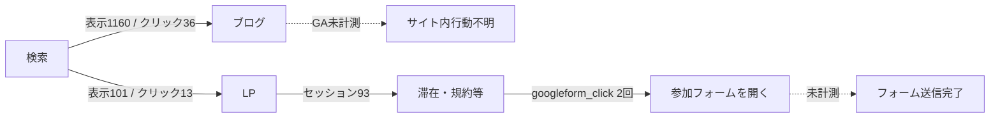

---
tags:
  - 2026-07-24
  - hagakure
  - web-analysis
run_id: 2026-07
period: 2026-06-26 .. 2026-07-23
---

# HAGAKURE Web 月次分析レポート（2026-07）

## 1. エグゼクティブサマリー

本期（28日）は、検索表示・クリックは前期比で減った一方、GA4 上のセッションは増えた。参加フォームへのリンククリックは **2回（前期2回）**だった。ただし、これはフォームを開いた回数であり送信完了数ではない。また、**ブログページには GA / GTM タグが無く、ブログのサイト内行動はほぼ未計測**である。検索ではブログ記事（技術検証・ツール比較）が流入の主戦場で、LP（`/`）は表示は少ないが CTR が高い。

コミュニティ目的（興味→参加、参加者のアウトプット、運営の学習）に照らすと、最優先は「アクセス増」ではなく、(1) **ブログ計測の復旧**、(2) **参加フォーム送信完了の計測**、(3) **ブログ記事の title / description 整備**（検索結果と記事内容の一致）、である。フォームリンクのクリックは取得できたが、フォーム経由の新規参加者は plan.md 上「現状 0名/年」とあり、送信完了は **未計測**のため増減は判断できない。

## 2. コミュニティとWebサイト運営目的の整理

HAGAKUREプログラミング塾は、佐賀でプログラミングや IT に関心を持つ人が世代・職業を超えて学び合う地域コミュニティである。「みんな塾生、みんな先生」を掲げ、共有とつながりを重視する。

| サイト | 外部者 | コミュニティ参加者 | サイト開発・運営者 |
| --- | --- | --- | --- |
| LP | 活動・趣旨への関心 → 参加フォーム | 紹介用ツール | 運営・開発の学習機会 |
| ブログ（Scroll） | 活動・学習事例を知る入口 → 参加関心 | アウトプットの場 | 同上 |

本レポートはアクセス最大化ではなく、上記目的の達成度を見る。

## 3. KGI・KPIの提案

plan.md §4 の空きを埋めつつ、現状値は分かるものだけ記載する。

### 提案 KGI

| サイト | 対象者 | 提案 KGI | 現状 |
| --- | --- | --- | --- |
| LP | 外部者 | 参加フォーム送信（ユニーク） | リンククリック **2回**（前期2回）。送信完了は未計測。plan.md の「ブログ経由 10名/年」と役割分担する場合は「LP 経由のフォーム送信」を別 KPI に |
| LP | 参加者 | 紹介しやすい状態維持（四半期1回の内容鮮度チェック合格） | 定性。現状値なし |
| LP | 開発・運営者 | 月次分析レポートの作成回数 / 小さな改善の実施回数 | 本レポートが 1 回目 |
| ブログ | 外部者 | ホームページ上の Google フォームからの新規参加者 **10名/年**（plan.md 既存） | plan.md 記載どおり **0名**（要・フォーム側での突合） |
| ブログ | 参加者 | ブログ投稿件数・投稿者数 / 年 | 本期は一覧上で複数の新着あり。件数の年次集計は **要・CMS/手動カウント** |
| ブログ | 開発・運営者 | 計測・投稿環境の改善を「学習テーマ」として完了した件数 | 未設定 |

### 提案 KPI（モニタリング用）

- 検索: 表示回数・クリック・CTR・主要クエリ（LP / ブログ別）
- サイト内: セッション、LP→フォームリンククリック（本期2回）、ブログ→LP / フォーム遷移（ブログ計測復旧後）
- コンテンツ: 記事のユニーク title / meta description 設定率
- コミュニティ負荷: 投稿者あたりの投稿頻度（過度なノルマにしない）

## 4. 使用したデータと分析対象期間

| 項目 | 内容 |
| --- | --- |
| 分析実行日 | 2026-07-24（JST） |
| 当期 | 2026-06-26 〜 2026-07-23（28日） |
| 前期 | 2026-05-29 〜 2026-06-25（28日） |
| GA4 | プロパティ ID `351757681`（Data API） |
| Search Console | `sc-domain:hagakurepgm.net` |
| コンテンツ | LP / ブログ一覧 / 主要記事 HTML の実査（`content-notes.md`） |
| 生データ | `reports/2026-07/raw/` |

集計規則: `page` が `/blog` または `/blog/` 始まりをブログ、それ以外を LP。

## 5. データ収集・計測上の問題

| 問題 | 深刻度 | 内容 |
| --- | --- | --- |
| ブログに GA/GTM が無い | **高** | LP HTML には `G-PQMQ82P18K` / `GTM-WLK68MXV` あり。ブログ一覧・個別記事 HTML からは検出できず。当期の GA4 ページ別は `/` 等 LP のみで、ブログ path のセッションは 0 |
| フォーム送信未計測 | **高** | `googleform_click` によりリンククリックは本期2回・前期2回と取得できたが、送信完了ではない。KGI（年10名）をサイトデータから検証不可 |
| 参加フォーム URL が2系統 | 中 | `forms.gle/...` と `docs.google.com/forms/d/e/...` が共存。同一かは未確認 |
| ブログ `<title>` が共通 | 中 | 検索結果・タブ表示が記事内容と一致しにくい（og:title / h1 には固有名あり） |
| ブログ meta description なし | 中 | 検索スニペットが制御しづらい |
| 前年同期比 | 低 | 本期は前期比のみ（スクリプト既定） |
| 地域・詳細行動 | 低 | 本期収集対象外 |
| Python 3.14 + pandas | 運用 | ダッシュボード依存は不安定。収集は pandas 非依存スクリプトで実施 |

## 6. LPの分析結果

### 実測サマリー（LP）

| 指標 | 当期 | 前期 | 差分の読み |
| --- | --- | --- | --- |
| 表示回数 | 101 | 122 | やや減少 |
| クリック | 13 | 15 | ほぼ横ばい |
| CTR | 12.9% | 12.3% | 高い水準を維持 |
| セッション（GA4・LP path） | 93 | 73 | 増加 |
| ユーザー | 62 | 63 | ほぼ横ばい |

主ページ `/`:

- 表示 45 / クリック 13 / CTR 約 29% / 平均掲載順位 約 4.6
- セッション 84、エンゲージメント率 約 42%、平均セッション時間 約 38 秒

その他 LP path: `/term_use/`（セッション4）、`/voice/`（4）、`/saga_bot/`（1）。`/voice/` は表示20・クリック0。

### 観点別

| 観点 | 評価の根拠（事実） | 解釈上の注意 |
| --- | --- | --- |
| 趣旨・活動の伝達 | About・おすすめ・声・入塾フローが存在 | 「伝わったか」の直接指標は無し |
| 参加検討に必要な情報 | 無料・Slack/GitHub 招待・1〜2日で連絡、と明記 | フォームリンククリックは2回。完了率は未計測 |
| 検索・外部からの獲得 | オーガニックセッション 31（サイト全体）。LP のブランドクエリは弱い（`hagakure` 表示6・クリック1） | Direct 51 は内訳不明（Slack 等の可能性は仮説） |
| 申し込み・関連ページ移動 | `/term_use/` `/voice/` へのセッションは少数。フォームリンククリックは2回（前期2回） | 送信完了は未計測 |
| 紹介ツールとしての使いやすさ | ナビにブログ・フォーム・規約があり一通り揃う | フォーム URL 二重は紹介時に混乱しうる |
| 運営継続しやすさ | 静的な説明中心で更新負荷は相対的に低そう | 推測を含む |

## 7. ブログの分析結果

### 実測サマリー（ブログ）

| 指標 | 当期 | 前期 |
| --- | --- | --- |
| 表示回数 | 1160 | 2397 |
| クリック | 36 | 59 |
| CTR | 3.1% | 2.5% |
| GA4 セッション（blog path） | **0** | 5（`/blog/` のみ等、ごくわずか） |

表示・クリック減は事実。ただしブログ行動が測れていないため、「読まれ方」や「LP/フォームへ進んだか」は **本期データでは判断不能**。

### 検索で動いているページ（当期・クリック順）

| page | 表示 | クリック | CTR | 記事内容（実査） |
| --- | --- | --- | --- | --- |
| `/blog/124/` | 112 | 11 | 9.8% | RunCat Neo×AIコーディングツール使用量 |
| `/blog/107/` | 334 | 10 | 3.0% | Gemma4 vs Gemma3 |
| `/blog/97/` | 21 | 4 | 19.0% | Moonshine Voice |
| `/blog/94/` | 75 | 3 | 4.0% | vibe-local |
| `/blog/ollamallm/` | 101 | 3 | 3.0% | Ollama ローカル LLM |
| `/blog/gpt-oss-vs-gemma3/` | 198 | 2 | 1.0% | gpt-oss vs gemma3 |

前期は `/blog/107/` がクリック28・表示1150と突出。本期も表示は多いがクリックは10。

### クエリの傾向（事実）

- 表示上位はツール・モデル名中心（例: `run cat neo`, `runcatneo`, `obsidian 名刺管理`, `佐賀弁変換`, `gemma3 gemma4 比較`）。
- コミュニティ名での流入は弱い（`hagakure` 表示6・クリック1）。
- 「佐賀でプログラミングを学びたい」系の意図クエリは、本期トップにはほとんど出ていない。

### 観点別

| 観点 | 事実 | コメント |
| --- | --- | --- |
| 活動・学習事例の入口 | 参加者投稿が継続し、技術検証記事が検索に出ている | 入口としては機能している可能性が高い（仮説は §11） |
| 検索流入 | ブログが表示・クリックの大半 | タイトルタグ共通は機会損失の疑い |
| 読まれているテーマ | AI/ローカルLLM/ツール検証がクリック上位 | GA4 無しのため回遊は不明 |
| LP・参加案内への移動 | ブログから LP へのリンクはある。フォーム CTA は弱い。遷移数は未計測 | — |
| アウトプットの場 | 「記事を書く」導線あり。新着が複数 | 投稿者数の正確値は未集計 |
| 運営の学習機会 | 本分析基盤・月次レポート自体が学習機会になりうる | プロセス指標はこれから |

## 8. 対象者別の分析結果

### 外部者

- **LP**: 検索からのクリックは少ないが CTR は高い。セッションは主に `/`。参加フォームリンクは2回クリックされたが、参加完了は未計測のため、最終的な目的達成は「わからない」。
- **ブログ**: 技術関心の検索需要には応答している。コミュニティ参加への橋渡し（フォーム）はデータ上確認できない。

### コミュニティ参加者

- ブログはアウトプット媒体として更新が見られる（実査）。
- 投稿負荷や投稿者の広がりは、追加データが必要。

### サイト開発・運営者

- 計測ギャップ（ブログタグなし・CV未設定）がはっきりしたことは、学習・改善テーマとして価値がある。
- 本リポジトリで収集〜レポートまで回せた（再現手順は `prompts/RUN_ANALYSIS.md`）。

## 9. 可視化したグラフ・表

### サイト全体 KPI（前期比）

| 指標 | 当期 | 前期 | 前期比 |
| --- | --- | --- | --- |
| 表示回数 | 1261 | 2519 | 約 -50% |
| クリック | 49 | 74 | 約 -34% |
| CTR | 3.89% | 2.94% | 改善 |
| セッション | 93 | 78 | 約 +19% |
| ユーザー | 62 | 68 | 約 -9% |

### 流入チャネル（GA4・サイト全体・当期）

| チャネル | セッション | ユーザー | エンゲージメント率 |
| --- | --- | --- | --- |
| Direct | 51 | 37 | 29.4% |
| Organic Search | 31 | 15 | 54.8% |
| Referral | 4 | 4 | 75.0% |

### デバイス（GA4・当期）

| デバイス | セッション | ユーザー |
| --- | --- | --- |
| desktop | 50 | 41 |
| mobile | 36 | 14 |

### LP / ブログ分担（当期）

## 10. 確認された事実

1. 当期の検索クリックの約 73%（36/49）はブログ、約 27%（13/49）は LP。
2. LP `/` の CTR は約 29% と高い。ブログ全体 CTR は約 3%。
3. 検索表示・クリックは前期より減少。セッションは増加。
4. GA4 の当期 pagePath にブログ記事 path がほぼ出ない。
5. ブログ HTML に GA/GTM が見つからない。LP にはある。
6. ブログ記事の `<title>` が共通文言で、固有タイトルは h1 / og:title 側。
7. ブログに meta description が見当たらない。
8. 参加フォーム導線は LP に複数ある。ブログ一覧では弱い。
9. 主要クエリはツール・モデル名中心で、ブランド名は弱い。
10. 参加フォームリンククリックは本期2回（前期2回）。フォーム送信数・新規参加者数は取得できていない。

## 11. 原因の仮説

| 確認された事実 | 原因の仮説 | 仮説の根拠 | 追加で必要なデータ | 検証方法 |
| --- | --- | --- | --- | --- |
| ブログの GA4 セッションが 0 に近い | ブログテンプレートに計測タグが未挿入 | HTML 差分（LP あり / ブログなし） | GTM コンテナの公開設定、サーバー側テンプレート | タグ追加後に同一期間で pagePath を再取得 |
| 検索表示が前期比で半減 | 特定記事（例: `/blog/107/`）の需要が一服した、または順位変動 | 前期はその1記事で表示1150・クリック28 | 記事別クエリ・順位の推移 | GSC のページ×クエリを数か月比較 |
| Direct が最多 | Slack / 口コミ / ブックマーク等のコミュニティ内回遊 | コミュニティ運用の文脈。データ上の内訳は無し | UTM、参照元の詳細 | 主要導線に UTM を付与して再計測 |
| ブログ CTR が低い記事がある | title が検索結果で差別化されていない | `<title>` 共通の事実 | 検索結果の実際の表示 | title を記事別に直した前後で CTR 比較 |
| フォーム経由参加が 0（plan 記載） | リンククリック後のフォーム摩擦、または送信完了の計測漏れ | リンククリックは本期2回あるが送信完了は未計測 | フォーム回答数 | フォーム回答と `googleform_click` の月次突合 |
| ブランド検索が弱い | 外部認知がまだ狭い、または別名で探されている | `hagakure` 表示が少ない事実 | オフライン認知、SNS 言及 | ブランドクエリの四半期モニタ |

## 12. 改善アクション

### A. すぐに実行でき、短期的な反応が期待できる

#### A1. ブログに GA4 / GTM を入れる

| 項目 | 内容 |
| --- | --- |
| 対象サイト | ブログ |
| 対象者 | 開発・運営者（結果は全員の判断材料） |
| 解決したい課題 | ブログ行動・導線が全く見えない |
| 根拠 | HTML にタグ無し / GA4 に blog path が出ない |
| 実施内容 | LP と同一の GTM（または GA4）をブログ共通テンプレートへ追加。動作確認 |
| 期待する効果 | blog の sessions / ページ別閲覧が数値で見える |
| 優先度 | **高** |
| 効果指標 | GA4 の `/blog` 配下 sessions > 0 |
| 確認時期 | 実装1〜2週間後 |

#### A2. 参加フォーム URL を1つに統一し、LP のリンクを整理

| 項目 | 内容 |
| --- | --- |
| 対象サイト | LP |
| 対象者 | 外部者・紹介する参加者 |
| 解決したい課題 | 導線の迷い・計測の分散 |
| 根拠 | 実査で2 URL を確認 |
| 実施内容 | 正規 URL を決め、ナビ・本文・画像ボタンを統一 |
| 期待する効果 | 紹介・分析が単純になる |
| 優先度 | **高** |
| 効果指標 | リンク先の単一化（定性）＋ `googleform_click` |
| 確認時期 | 修正直後 |

#### A3. クリック上位記事の `<title>` / meta description を記事固有に修正

| 項目 | 内容 |
| --- | --- |
| 対象サイト | ブログ |
| 対象者 | 外部者 |
| 解決したい課題 | 検索結果と記事内容の不一致、CTR 機会損失の疑い |
| 根拠 | title 共通・desc なし（実査）。高表示・低 CTR 記事の存在 |
| 実施内容 | まず `/blog/107/`, `/blog/gpt-oss-vs-gemma3/`, `/blog/ollamallm/` など表示上位から修正 |
| 期待する効果 | 対象記事の CTR 改善（保証はしない） |
| 優先度 | **高** |
| 効果指標 | 対象 URL の CTR・クリック |
| 確認時期 | 修正後 2〜4 週 |

### B. すぐに実行でき、長期的な反応が期待できる

#### B1. ブログ記事から LP / 参加フォームへの案内をテンプレ化（押し付けない短文）

| 項目 | 内容 |
| --- | --- |
| 対象サイト | ブログ |
| 対象者 | 外部者 |
| 解決したい課題 | 事例入口から参加検討への橋が弱い |
| 根拠 | 一覧に参加 CTA が弱い（実査）。遷移未計測 |
| 実施内容 | 記事末尾に「HAGAKURE は佐賀のゆるい学びコミュニティです。気になったら LP / 参加フォームへ」程度の共通ブロック |
| 期待する効果 | フォーム到達の芽。コミュニティの温度を壊さない文言にする |
| 優先度 | **中** |
| 効果指標 | （計測復旧後）ブログ→LP / フォームイベント |
| 確認時期 | 3 か月 |

#### B2. 月次で本プロンプト分析を継続し、事実3つ＋小さな改善1つを残す

| 項目 | 内容 |
| --- | --- |
| 対象サイト | 両方 |
| 対象者 | 開発・運営者 |
| 解決したい課題 | 運営自体を学習機会にする |
| 根拠 | plan.md の運営者目的 |
| 実施内容 | `@prompts/RUN_ANALYSIS.md` を毎月実行。A 系を1つまで |
| 期待する効果 | 無理のない改善の継続 |
| 優先度 | **中** |
| 効果指標 | レポート作成回数、実施アクション数 |
| 確認時期 | 毎月末 |

### C. 実行に時間がかかるが、長期的な反応が期待できる

#### C1. フォーム送信を GA4 キーイベント化し、年次 KGI を見える化

| 項目 | 内容 |
| --- | --- |
| 対象サイト | LP（必要ならブログ） |
| 対象者 | 外部者・運営 |
| 解決したい課題 | 「新規参加者 10名/年」がサイト側で追えない |
| 根拠 | 現状 CV 未計測 |
| 実施内容 | フォーム側の回答数確認手順＋可能なら thanks ページ / イベント計測 |
| 期待する効果 | KGI の月次モニタ |
| 優先度 | **高**（効果は長期だが基盤として重要） |
| 効果指標 | フォーム送信数（実測） |
| 確認時期 | 設定後、四半期 |

#### C2. 投稿者オンボーディングを軽くする（ガイドラインの見せ方・最初の1本支援）

| 項目 | 内容 |
| --- | --- |
| 対象サイト | ブログ |
| 対象者 | 参加者 |
| 解決したい課題 | アウトプットの場としての裾野 |
| 根拠 | 投稿導線はあるが、負荷・心理的ハードルは未計測 |
| 実施内容 | ガイドライン要約、「完璧でなくてよい」例示。ノルマは設けない |
| 期待する効果 | 投稿者数・多様なテーマ（急増を目指さない） |
| 優先度 | **中** |
| 効果指標 | 投稿者数、投稿件数（年） |
| 確認時期 | 半年 |

## 13. アクションの優先順位

評価軸: 目的整合 / 効果 / 期間 / 検証容易性 / コミュニティ性格 / 継続可能性。

| 順位 | アクション | 理由 |
| --- | --- | --- |
| 1 | A1 ブログ計測復旧 | これがないと以後の分析が推測だらけになる。運営の学習にも直結 |
| 2 | C1 フォーム計測 | KGI（年10名）の唯一の本命指標を見える化する |
| 3 | A2 フォーム URL 統一 | すぐでき、計測・紹介のノイズを減らす |
| 4 | A3 記事 title/description | 既存アウトプットを活かす。新規量産を求めない |
| 5 | B1 記事末の軽い導線 | 参加橋渡し。文言は控えめに |
| 6 | B2 月次分析の継続 | 負担を増やさず運営学習を定着 |
| 7 | C2 投稿オンボーディング | 中長期。ノルマ化しないこと |

**やらない／後回し**: 広告出稿、急成長向けのファネル最適化、投稿義務化、アクセス数だけを追う KPI 設計。

## 14. 効果検証の方法

| 施策 | 見る指標 | 比較方法 | 判定の目安（ゆるく） |
| --- | --- | --- | --- |
| A1 | GA4 `/blog` sessions、ページ別 PV | 実装前後 14 日 | blog sessions が継続的に記録される |
| A2 | リンク監査（手動） | チェックリスト | 全 CTA が同一 URL |
| A3 | GSC ページ別 CTR・クリック | 修正前後 28 日 | 悪化が続きなければ継続。改善はボーナス |
| B1 | （A1 後）ブログ→LP / フォーム | イベント | 少数でも発生すれば成功 |
| C1 | フォーム回答数 | 月次・年次 | 年10名は年次で評価。未達でも責める指標にしない |
| B2 | レポート有無、A/B/C 実施数 | 月次 | 「毎月1回回せた」を合格線に |

検証時も、指標の増減だけでコミュニティの良し悪しを判断しない。

## 15. 今後追加で収集すべきデータ

1. ブログ計測復旧後の pagePath / ランディング / 参照元
2. 参加フォームリンククリック（`googleform_click`、月次）とフォーム回答数の突合
3. ブログ→LP→フォームのファネル（イベント）
4. 投稿者数・投稿数の年次集計（CMS または手動）
5. 主要記事のクエリ×ページ（GSC）と title 変更履歴
6. Direct 内訳を探るための UTM（Slack 告知など、負担にならない範囲）
7. 地域・デバイスは必要になったら（今は必須でない）
8. 表示速度・モバイル実機確認（実査の穴）

---

## 付録: 生データ場所

- `reports/2026-07/raw/summary.json`
- `reports/2026-07/raw/*.csv`
- `reports/2026-07/content-notes.md`
